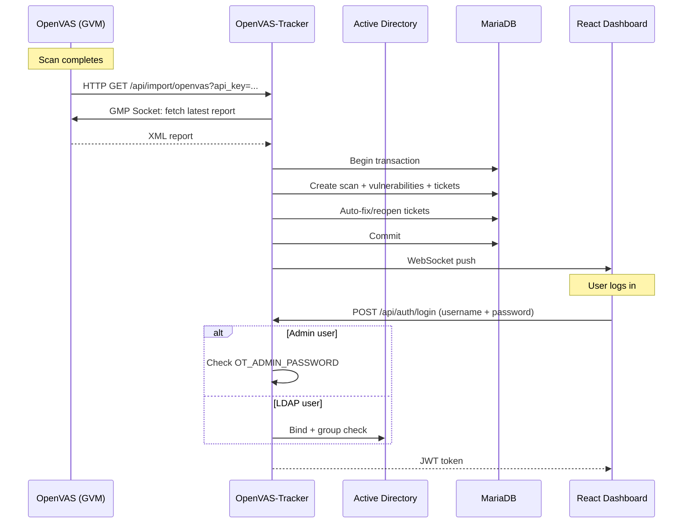

# OpenVAS-Tracker

Vulnerability management dashboard that imports OpenVAS scan results and tracks remediation through automated ticketing.

## Features

- **OpenVAS Import**: Webhook endpoint receives scan results automatically when scans complete
- **Automatic Ticketing**: New findings create tickets, missing findings auto-resolve, recurring findings reopen
- **Ticket Lifecycle**: open → fixed / risk_accepted / false_positive, with full activity audit trail
- **Risk Acceptance with Expiry**: Risk-accepted tickets auto-reopen after expiry date
- **Scan Comparison**: Side-by-side diff of two scans — new, fixed, unchanged findings
- **Bulk Actions**: Select multiple tickets for batch status change or assignment
- **Host-centric View**: Aggregated vulnerability counts and ticket status per host with expandable ticket list
- **Dashboard**: Open ticket counts by priority, trend over time, "My Tickets" and "Unassigned" quick filters
- **CVE References**: NVD, MITRE, and Google links on tickets with CVE; title-based search for tickets without
- **Also Affected**: See which other hosts have the same vulnerability
- **DNS Hostname Resolution**: Automatic PTR lookup for host IPs, shown alongside IPs everywhere
- **LDAP / Active Directory**: Optional AD authentication with group-based access control
- **Admin + LDAP Auth**: Built-in admin user with configurable password, plus optional LDAP for team access
- **Settings UI**: Edit all configuration (.env file) from the browser, test LDAP connection
- **Filterable & Sortable Tables**: All list views with column sorting, multi-filter, full-text search across all columns
- **Report Generation**: HTML, PDF, Excel, Markdown
- **Real-time Updates**: WebSocket push notifications
- **Embedded React SPA**: Single binary, no separate frontend deploy

## Architecture



```
┌──────────────┐     HTTP GET (alert)      ┌──────────────────┐     ┌─────────────┐
│   OpenVAS    │ ──────────────────────────▶│                  │────▶│  MariaDB    │
│   (GVM)      │◀── GMP socket (fetch) ────│  OpenVAS-Tracker │     └─────────────┘
│              │         XML report         │   (Go + React)   │
└──────────────┘                            └──────────────────┘
                                              │          │
                                         :8080│     LDAP │
                                              ▼          ▼
                                      ┌──────────┐  ┌──────────────┐
                                      │ Browser  │  │   Active     │
                                      │Dashboard │  │  Directory   │
                                      └──────────┘  └──────────────┘
```

## Quick Start with Docker

```bash
cp .env.example .env    # edit: set OT_JWT_SECRET, OT_ADMIN_PASSWORD, OT_IMPORT_APIKEY
docker compose up -d
```

This starts MariaDB + the app. The UI is at http://localhost:8080.

> **Important:** `OT_JWT_SECRET` must be a random string of at least 32 characters.

### Login

Default admin login: username `admin`, password from `OT_ADMIN_PASSWORD` in `.env`.

### Import an OpenVAS report

```bash
curl -X POST http://localhost:8080/api/import/openvas \
  -H 'X-API-Key: <your-api-key-min-32-chars>' \
  -H 'Content-Type: application/xml' \
  --data-binary @scan-report.xml
```

## Quick Start without Docker (Bare Metal)

### Prerequisites

- Go 1.24+
- Node.js 22+ and npm
- MariaDB 10.6+ (or MySQL 8+)

### Setup

```bash
# 1. Create database
mysql -e "CREATE DATABASE \`openvas-tracker\` CHARACTER SET utf8mb4;"

# 2. Run migrations
make migrate-up

# 3. Configure
cat > .env << EOF
OT_DATABASE_DSN=root@tcp(localhost:3306)/openvas-tracker?parseTime=true
OT_JWT_SECRET=$(openssl rand -hex 32)
OT_IMPORT_APIKEY=$(openssl rand -hex 32)
OT_ADMIN_PASSWORD=your-admin-password
EOF

# 4. Build and run
make build
./bin/openvas-tracker
```

## Configuration

All config via `.env` file. Editable from the Settings page in the UI.

| Variable | Default | Purpose |
|----------|---------|---------|
| `OT_SERVER_PORT` | 8080 | HTTP listen port |
| `OT_DATABASE_DSN` | `...@tcp(localhost:3306)/openvas-tracker?parseTime=true` | MariaDB DSN |
| `OT_JWT_SECRET` | (none — **required**) | JWT signing key (min 32 chars) |
| `OT_IMPORT_APIKEY` | (empty) | API key for import webhook (min 32 chars) |
| `OT_ADMIN_PASSWORD` | (empty) | Admin user password |
| `OT_LDAP_URL` | (empty) | LDAP server URL (e.g. `ldaps://dc01.example.com:636`) |
| `OT_LDAP_BASE_DN` | (empty) | LDAP search base DN |
| `OT_LDAP_BIND_DN` | (empty) | LDAP service account DN |
| `OT_LDAP_BIND_PASSWORD` | (empty) | LDAP service account password |
| `OT_LDAP_GROUP_DN` | (empty) | Required AD group for access |
| `OT_LDAP_USER_FILTER` | `(sAMAccountName=%s)` | LDAP user search filter |

## Authentication

**Three auth sources, tried in order:**

1. **Admin**: Username `admin` + `OT_ADMIN_PASSWORD` → always available
2. **LDAP**: Bind against Active Directory, verify group membership → if `OT_LDAP_URL` configured
3. **DB fallback**: Check existing database users → for backwards compatibility

No self-registration. Users are either the admin, AD members, or pre-existing DB accounts.

LDAP users are auto-created in the DB on first login. Their DB record is used for ticket assignment and activity logging.

## OpenVAS Configuration

OpenVAS-Tracker does not control OpenVAS — it only receives scan results.

### Setup

1. Set `OT_IMPORT_APIKEY` in `.env` (min 32 chars)
2. In GSA: **Configuration → Alerts → New Alert**
   - Event: Task run status changed → Done
   - Method: HTTP Get
   - URL: `http://<tracker-host>:8080/api/import/openvas?api_key=<your-api-key>`
3. Attach the alert to your scan task

### Manual Import

```bash
curl -X POST http://localhost:8080/api/import/openvas \
  -H 'X-API-Key: <key>' -H 'Content-Type: application/xml' \
  --data-binary @report.xml
```

## Ticket Lifecycle

```
Import finds new vulnerability     →  Ticket created (open)
Import finds same vulnerability    →  Ticket updated (last_seen_at)
Import missing old vulnerability   →  Ticket auto-fixed
Import re-finds fixed vuln        →  Ticket reopened (open)
Import re-finds false_positive     →  Skipped (never reopened)
Risk acceptance expires            →  Ticket auto-reopened
User marks ticket                  →  fixed / risk_accepted / false_positive
```

All status changes logged with actor (user ID or "Automatic").

## API

| Method | Path | Description |
|--------|------|-------------|
| POST | /api/auth/login | Login (username + password), get JWT |
| POST | /api/import/openvas | Import OpenVAS XML (API-Key auth) |
| GET | /api/import/openvas | Trigger GMP fetch (API-Key auth) |
| GET | /api/hosts | Host summaries with ticket status |
| GET | /api/hosts/:host/tickets | Tickets for a host |
| GET | /api/scans | List scans |
| GET | /api/scans/diff?old=X&new=Y | Compare two scans |
| GET | /api/scans/:id | Scan detail |
| GET | /api/tickets | List all tickets |
| GET | /api/tickets/:id | Ticket detail |
| PATCH | /api/tickets/:id/status | Change status |
| PATCH | /api/tickets/:id/assign | Assign to user |
| POST | /api/tickets/bulk | Bulk status/assign |
| POST/GET | /api/tickets/:id/comments | Add/list notes |
| GET | /api/tickets/:id/activity | Activity log |
| GET | /api/tickets/:id/also-affected | Other hosts with same finding |
| GET | /api/dashboard | Priority counts + ticket stats |
| GET | /api/dashboard/trend | Vuln trend over time |
| GET | /api/settings/setup | Setup guide |
| GET | /api/settings/users | User list (local + LDAP) |
| GET | /api/settings/env | Read .env config (masked) |
| PUT | /api/settings/env | Update single .env key |
| PUT | /api/settings/env/batch | Update multiple .env keys |
| POST | /api/settings/ldap/test | Test LDAP connection |
| GET | /api/health | Health check (DB ping) |

## Tech Stack

- **Backend**: Go 1.26, Echo v4, MariaDB, golang-jwt, bcrypt, godotenv, go-ldap
- **Frontend**: React 19, Vite, Tailwind CSS, TanStack Query, Recharts, Zustand
- **Deploy**: Docker Compose (MariaDB + single Go binary with embedded SPA)

## License

GPL v3
