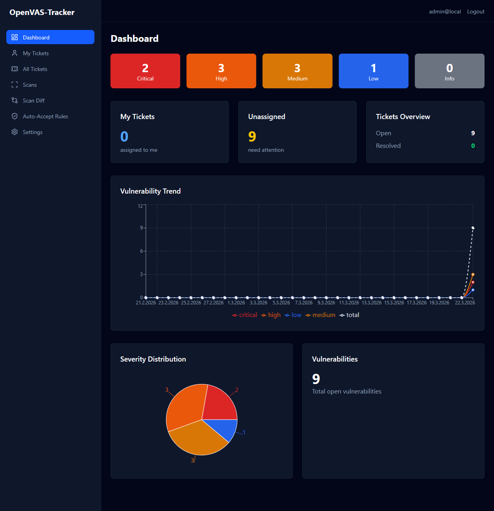
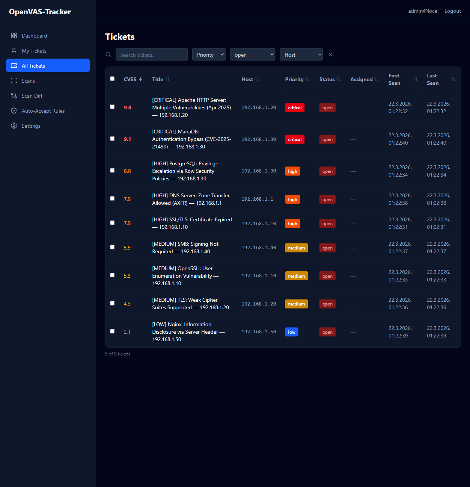
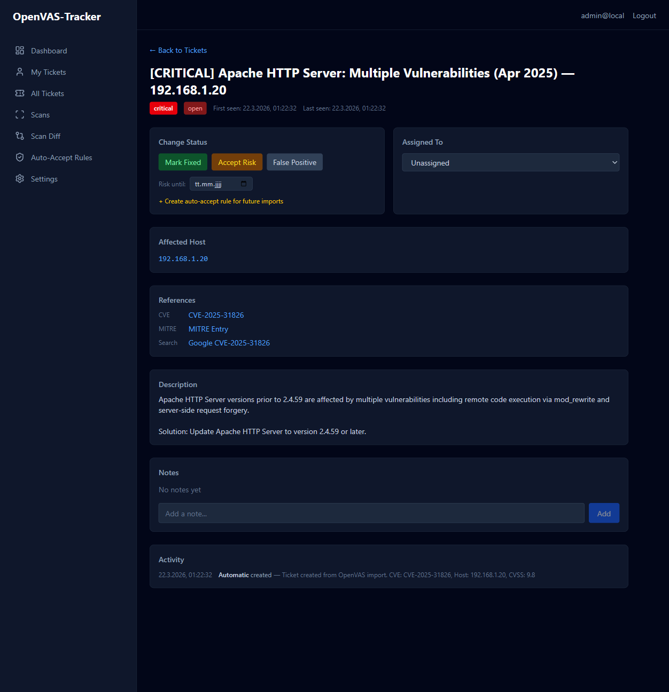
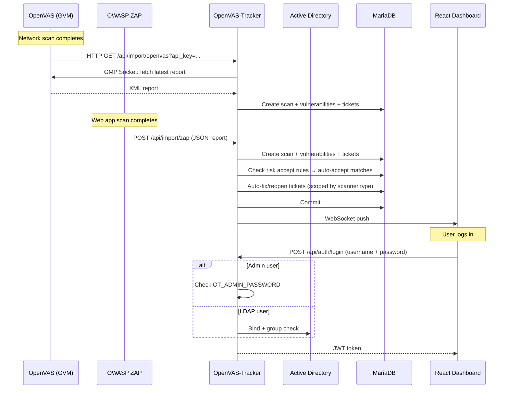

# OpenVAS-Tracker

Vulnerability management dashboard that imports OpenVAS and OWASP ZAP scan results and tracks remediation through automated ticketing.

## Screenshots

| Dashboard | Tickets | Ticket Detail |
|-----------|---------|---------------|
|  |  |  |

## Features

- **OpenVAS Import**: Webhook endpoint receives scan results automatically when scans complete
- **OWASP ZAP Import**: Webhook endpoint for ZAP Traditional JSON Reports — URL-granular ticketing for web application findings
- **Multi-Scanner Architecture**: Pluggable parser interface supports multiple scanner types with scan-type-scoped auto-resolve
- **Automatic Ticketing**: New findings create tickets, missing findings auto-resolve, recurring findings reopen
- **Flapping Protection**: Configurable threshold (default 3) of consecutive scan misses before auto-resolve — prevents noisy ticket churn from intermittent scan results, with visible `pending_resolution` intermediate status
- **Scope-aware Auto-resolve**: Importing a scan only auto-resolves tickets for hosts that were in that scan's scope — other subnets are unaffected
- **Ticket Lifecycle**: open → pending_resolution → fixed / risk_accepted / false_positive, with full activity audit trail
- **Risk Acceptance with Expiry**: Risk-accepted tickets auto-reopen after expiry date
- **Auto-Accept Rules**: Define rules (by CVE or title, per host or globally) to automatically accept known risks on future imports — configurable from any ticket
- **Scan Comparison**: Side-by-side diff of two scans — new, fixed, unchanged findings
- **Bulk Actions**: Select multiple tickets for batch status change or assignment
- **Dashboard**: Open ticket counts by priority, 30-day trend chart, "My Tickets" and "Unassigned" quick filters
- **CVE References**: NVD, MITRE, and Google links on tickets with CVE; title-based search for tickets without
- **Also Affected**: See which other hosts have the same vulnerability
- **DNS Hostname Resolution**: Automatic PTR lookup, normalized (UPPERCASE.domain.lowercase), shown everywhere
- **LDAP / Active Directory**: Optional AD authentication with group-based access control
- **Admin + LDAP Auth**: Built-in admin user plus optional LDAP for team access, login by username
- **Settings UI**: Edit all configuration (.env file) from the browser, test LDAP connection
- **Filterable & Sortable Tables**: Column sorting, multi-filter, full-text search across all columns, default filter on open tickets
- **Report Generation**: HTML, PDF, Excel, Markdown — technical, executive, compliance, comparison, and trend report types
- **Teams & Collaboration** (API only): Create teams with member roles (owner, admin, member), invite users, assign tickets to teams
- **Assets Management** (API only): Automatic asset inventory — hostname, IP, MAC, OS, open ports, services, risk score
- **Targets Management**: Define and manage scan targets/scopes
- **Notifications**: In-app notification system with unread counts and WebSocket real-time push
- **Audit Logging**: Full audit trail of all user actions
- **Global Search**: Search across tickets, vulnerabilities, and hosts
- **Embedded React SPA**: Single binary, no separate frontend deploy

## Architecture



## Quick Start with Docker

```bash
cp .env.example .env    # edit: set OT_JWT_SECRET, OT_ADMIN_PASSWORD, OT_IMPORT_APIKEY
docker compose up -d
```

The UI is at http://localhost:8080. Login: username `admin`, password from `OT_ADMIN_PASSWORD`.

## Quick Start without Docker

```bash
# 1. Create database
mysql -e "CREATE DATABASE \`openvas-tracker\` CHARACTER SET utf8mb4;"

# 2. Run migrations
make migrate-up

# 3. Configure
cat > .env << EOF
OT_DATABASE_DSN=root@tcp(localhost:3306)/openvas-tracker?parseTime=true
OT_JWT_SECRET=$(openssl rand -hex 32)
OT_IMPORT_APIKEY=$(openssl rand -hex 32)
OT_ADMIN_PASSWORD=your-admin-password
EOF

# 4. Build and run
make build && ./bin/openvas-tracker
```

## Configuration

All config via `.env` file. Editable from the Settings page in the UI.

| Variable | Default | Purpose |
|----------|---------|---------|
| `OT_SERVER_PORT` | 8080 | HTTP listen port |
| `OT_DATABASE_DSN` | `...@tcp(localhost:3306)/openvas-tracker?parseTime=true` | MariaDB DSN |
| `OT_JWT_SECRET` | (none — **required**) | JWT signing key (min 32 chars) |
| `OT_IMPORT_APIKEY` | (empty) | API key for import webhook (min 32 chars) |
| `OT_ADMIN_PASSWORD` | (empty) | Admin user password |
| `OT_AUTORESOLVE_THRESHOLD` | `3` | Consecutive scans without finding before auto-resolve |
| `OT_LDAP_URL` | (empty) | LDAP server URL |
| `OT_LDAP_BASE_DN` | (empty) | LDAP search base DN |
| `OT_LDAP_BIND_DN` | (empty) | LDAP service account DN |
| `OT_LDAP_BIND_PASSWORD` | (empty) | LDAP service account password |
| `OT_LDAP_GROUP_DN` | (empty) | Required AD group for access |
| `OT_LDAP_USER_FILTER` | `(sAMAccountName=%s)` | LDAP user search filter |

## Authentication

1. **Admin**: Username `admin` + `OT_ADMIN_PASSWORD` → always available
2. **LDAP**: Bind against Active Directory, verify group membership → if configured
3. **DB fallback**: Existing database users → for backwards compatibility

No self-registration. LDAP users auto-created in DB on first login and also when the user list is loaded (Settings → Users), so they can be assigned to tickets before their first login.

## OpenVAS Setup

1. Set `OT_IMPORT_APIKEY` in `.env`
2. In GSA: **Configuration → Alerts → New Alert** → HTTP Get → `http://<host>:8080/api/import/openvas?api_key=<key>`
3. Attach alert to scan task

## ZAP Setup

ZAP scans are run externally — the tracker receives results via webhook. The same `OT_IMPORT_APIKEY` is used for both OpenVAS and ZAP imports.

### Manual (ZAP Desktop)

1. Run your scan in ZAP (Spider + Active Scan)
2. Export report: **Report → Generate Report → Traditional JSON**
3. Send to tracker:

```bash
curl -X POST https://your-server:8080/api/import/zap \
  -H "X-API-Key: your-api-key" \
  -H "Content-Type: application/json" \
  -d @zap-report.json
```

### Automated (ZAP Docker)

```bash
# Full scan (spider + active scan)
docker run --rm -v $(pwd):/zap/wrk ghcr.io/zaproxy/zaproxy:stable \
  zap-full-scan.py -t https://target-app.example.com -J zap-report.json

# Send results to tracker
curl -X POST https://your-server:8080/api/import/zap \
  -H "X-API-Key: your-api-key" \
  -H "Content-Type: application/json" \
  -d @zap-report.json
```

ZAP Docker scan modes:
- `zap-baseline.py` — Passive checks only (fast, safe for production)
- `zap-full-scan.py` — Spider + active scan (thorough, sends attack payloads)
- `zap-api-scan.py` — API scan against OpenAPI/Swagger definitions

### Cron Example

```bash
#!/bin/bash
# /usr/local/bin/zap-scan-and-import.sh
TARGET="https://internal-app.example.com"
APIKEY="your-32-char-api-key"
REPORT="/tmp/zap-report.json"

docker run --rm --network host \
  -v /tmp:/zap/wrk ghcr.io/zaproxy/zaproxy:stable \
  zap-full-scan.py -t "$TARGET" -J zap-report.json

curl -s -X POST http://localhost:8080/api/import/zap \
  -H "X-API-Key: $APIKEY" \
  -H "Content-Type: application/json" \
  -d @"$REPORT"

rm -f "$REPORT"
```

### How ZAP Findings Become Tickets

- Each alert instance (URL + parameter combination) creates a separate ticket
- Fingerprint: `cwe:<ID>:url:<path>:param:<name>` (or CVE if present)
- Severity mapping: ZAP riskcode 3→high (CVSS 7.0), 2→medium (4.0), 1→low (2.0), 0→info (skipped)
- Auto-resolve is scoped by scanner type — ZAP scans only affect ZAP tickets, never OpenVAS tickets

## Ticket Lifecycle

```
Import finds new vulnerability     →  Ticket created (open)
Import matches risk accept rule    →  Ticket created (risk_accepted)
Import finds same vulnerability    →  Ticket updated (last_seen_at)
Import missing old vulnerability   →  Ticket pending_resolution (miss counter +1)
Consecutive misses reach threshold →  Ticket auto-fixed
Finding reappears while pending    →  Counter reset, ticket back to open
Import re-finds fixed vuln        →  Ticket reopened (open)
Import re-finds false_positive     →  Skipped (never reopened)
Risk acceptance expires            →  Ticket auto-reopened
```

## Auto-Accept Rules

Rules automatically set matching tickets to `risk_accepted` during import. Created from any ticket's detail page with scope "this host only" or "all hosts". Managed via the Auto-Accept Rules page.

Matching by: CVE ID (if available) or vulnerability title. Optional expiry date.

## API

| Method | Path | Description |
|--------|------|-------------|
| POST | /api/auth/login | Login (username + password) |
| POST | /api/import/openvas | Import OpenVAS XML (API-Key) |
| GET | /api/import/openvas | Trigger GMP fetch (API-Key) |
| POST | /api/import/zap | Import ZAP JSON report (API-Key) |
| GET | /api/hosts/:host/vulnerabilities | Vulnerabilities for a host |
| GET | /api/scans | List scans |
| GET | /api/scans/diff?old=X&new=Y | Compare two scans |
| GET | /api/scans/:id | Scan detail |
| GET | /api/tickets | List all tickets |
| POST | /api/tickets/bulk | Bulk status/assign |
| GET | /api/tickets/:id | Ticket detail |
| PATCH | /api/tickets/:id/status | Change status |
| PATCH | /api/tickets/:id/assign | Assign to user |
| POST | /api/tickets/:id/risk-rule | Create auto-accept rule from ticket |
| POST/GET | /api/tickets/:id/comments | Notes |
| GET | /api/tickets/:id/activity | Activity log |
| GET | /api/tickets/:id/also-affected | Other affected hosts |
| GET | /api/dashboard | Priority counts + ticket stats |
| GET | /api/dashboard/trend | 30-day open ticket trend |
| GET | /api/settings/setup | Setup guide |
| GET | /api/settings/users | User list (local + LDAP) |
| GET/PUT | /api/settings/env | Read/write .env config |
| POST | /api/settings/ldap/test | Test LDAP connection |
| GET | /api/settings/risk-rules | List auto-accept rules |
| POST | /api/settings/risk-rules/apply | Re-apply rules to existing open tickets |
| DELETE | /api/settings/risk-rules/:id | Delete rule |
| GET | /api/vulnerabilities | List vulnerabilities |
| GET | /api/vulnerabilities/:id | Vulnerability detail |
| PATCH | /api/vulnerabilities/:id/status | Update vulnerability status |
| POST | /api/tickets | Create ticket manually |
| GET | /api/search?q= | Global search |
| GET | /api/assets | List assets |
| GET | /api/assets/:id | Asset detail |
| GET | /api/targets | List targets |
| POST | /api/targets | Create target |
| GET | /api/teams | List teams |
| POST | /api/teams | Create team |
| GET | /api/notifications | List notifications |
| PUT | /api/notifications/read-all | Mark all read |
| GET | /api/audit | Audit log |
| POST | /api/reports | Generate report |
| GET | /api/reports/:id | Download report |
| PUT | /api/settings/env/batch | Batch update config |
| GET | /api/health | Health check |

## Tech Stack

- **Backend**: Go 1.26, Echo v4, MariaDB, golang-jwt, bcrypt, godotenv, go-ldap
- **Frontend**: React 19, Vite, Tailwind CSS, TanStack Query, Recharts, Zustand
- **Deploy**: Docker Compose or systemd (Debian). Database migrations auto-applied on startup

## Donate

If you find this project useful, consider supporting development:

**XMR (Monero):**
```
89fMD41wm8n88tgVj836qf3m16odqRjBhLti8dmVbvgsYAuEpTGfHBL7zNW8hingxQJNLWXfP3c2tgyyUMxYBiqHVYWR2rU
```

## License

GPL v3
