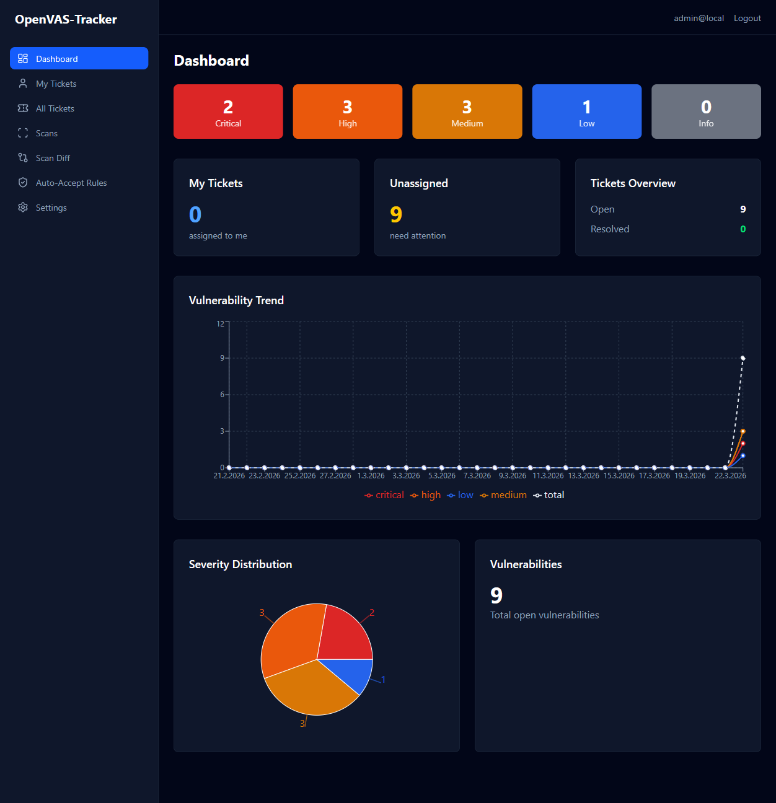
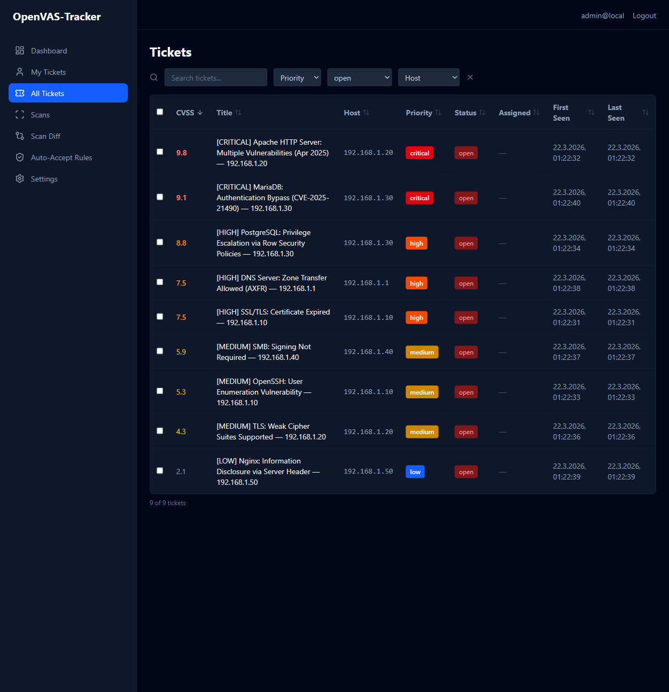
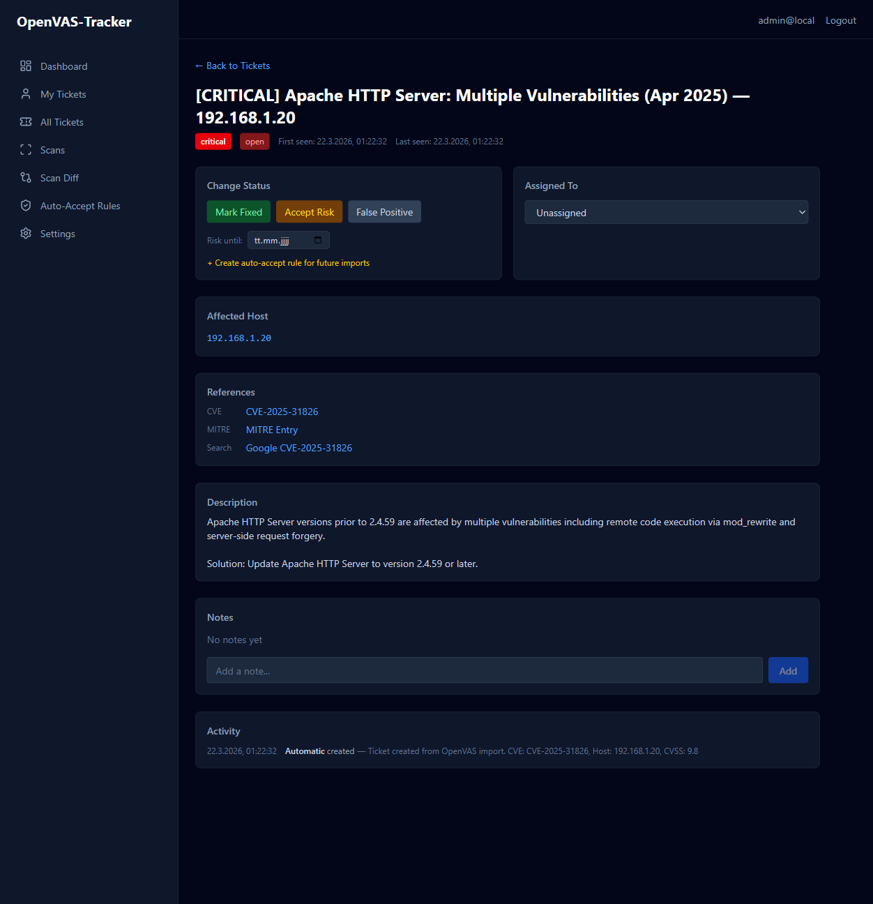
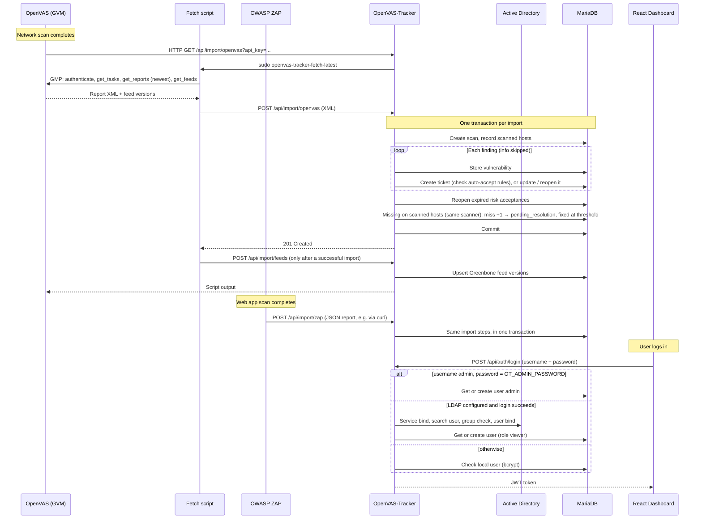

# OpenVAS-Tracker

Vulnerability management dashboard that imports OpenVAS and OWASP ZAP scan results and tracks remediation through automated ticketing.

## Screenshots

| Dashboard | Tickets | Ticket Detail |
|-----------|---------|---------------|
|  |  |  |

## Features

- **OpenVAS Import**: Webhook endpoint receives scan results automatically when scans complete, with original scan timestamps preserved from GMP reports
- **OWASP ZAP Import**: Webhook endpoint for ZAP Traditional JSON Reports — one ticket per host per alert type, with every affected URL and parameter listed in the ticket detail
- **Multi-Scanner Architecture**: Pluggable parser interface supports multiple scanner types with scan-type-scoped auto-resolve
- **Automatic Ticketing**: New findings create tickets, missing findings auto-resolve, recurring findings reopen
- **Flapping Protection**: Configurable threshold (default 3) of consecutive scan misses before auto-resolve — prevents noisy ticket churn from intermittent scan results, with visible `pending_resolution` intermediate status
- **Scope-aware Auto-resolve**: Importing a scan only auto-resolves tickets for hosts that were in that scan's scope — other subnets are unaffected
- **Ticket Lifecycle**: open → pending_resolution → fixed / risk_accepted / false_positive, with full activity audit trail
- **Risk Acceptance with Expiry**: Risk-accepted tickets auto-reopen after expiry date (checked during imports)
- **Auto-Accept Rules**: Define rules (by CVE or title, per host or globally) to automatically accept known risks on future imports — configurable from any ticket
- **Scan Comparison**: Side-by-side diff of two scans, classifying each finding as new, rediscovered, pending-fix, fixed, risk-accepted, host-not-scanned, or unchanged. Coverage-aware (a host absent from one scan is flagged `host_unscanned` instead of falsely new/fixed) and flap-aware (a finding whose ticket predates the scan is not reported as new)
- **Bulk Actions**: Select multiple tickets for batch status change or assignment
- **Dashboard**: Open ticket counts by priority, scan source distribution pie chart (OpenVAS vs ZAP), 30-day trend chart, "My Tickets" and "Unassigned" quick filters
- **Greenbone Feed Freshness**: The GMP fetch script reports feed versions after each import; Dashboard and Settings show whether NVT/SCAP/CERT feeds are current
- **CVE & CWE References**: NVD, MITRE, and Google links on tickets with CVE; CWE links for ZAP findings; title-based search for tickets without
- **Also Affected**: See which other hosts have the same vulnerability — click any affected host to filter tickets by that host
- **DNS Hostname Resolution**: Automatic PTR lookup with 48h cache and 3s per-lookup timeout, normalized (UPPERCASE.domain.lowercase), runs async after import so a misbehaving DNS can never stall an import
- **Login**: Built-in `admin` user plus optional LDAP / Active Directory login, which can be limited to the members of one AD group; login by username. All logged-in users have the same rights (see [Authentication](#authentication))
- **Settings UI**: Edit common configuration keys (.env file) from the browser, test LDAP connection (changes need a service restart)
- **E-Mail Notifications**: After each import, one digest of new and reopened unassigned tickets to a configurable address; a mail to the assignee on every assignment (single, bulk, or on creation; not on self-assignment). SMTP relay (STARTTLS when the server offers it, `AUTH PLAIN`; port 465 with implicit TLS is not supported) is configured in Settings and applies immediately; each user can switch off assignment mails under Settings → Profile
- **Filterable & Sortable Tables**: Column sorting, multi-filter (priority, status, host, scan source, assignee), full-text search across all columns, searchable host filter with hostname autocomplete, default filter on open tickets
- **Report Generation** (API only; the hidden page `/reports` lists your reports): One vulnerability report over the selected scans, as HTML, PDF, Excel or Markdown. The API also takes a `report_type` (technical, executive, compliance, comparison, trend), but only stores it — every type gives the same report
- **Teams** (API only; the hidden page `/teams` lists the teams): Create teams (the creator becomes `owner`) and add members as `admin` or `member`. Tickets cannot be assigned to teams. Invitations are only stored: no mail is sent, and there is no way to accept them
- **Assets** (API only, dormant): Endpoints to list and delete assets exist, but nothing fills the asset table — it stays empty
- **Targets** (API only): Store a list of hosts. Nothing else uses them — the tracker does not scan, and imports are not linked to targets
- **Notifications** (API only, dormant): Endpoints for listing and marking notifications exist, but nothing currently generates them and no UI consumes them
- **Audit Log** (API only, dormant): The audit endpoint exists, but nothing writes audit entries — it always returns an empty list
- **Global Search** (API only): Searches vulnerability titles and descriptions, ticket titles (they contain the host) and targets
- **Hidden pages**: `/hosts` (scanned hosts with their tickets) and `/vulnerabilities` work, but have no sidebar entry
- **Embedded React SPA**: Single binary, no separate frontend deploy

## Architecture


```mermaid
sequenceDiagram
    participant OV as OpenVAS (GVM)
    participant FS as Fetch script
    participant ZAP as OWASP ZAP
    participant TR as OpenVAS-Tracker
    participant AD as Active Directory
    participant DB as MariaDB
    participant UI as React Dashboard

    Note over OV: Network scan completes
    OV->>TR: HTTP GET /api/import/openvas?api_key=...
    TR->>FS: sudo openvas-tracker-fetch-latest
    FS->>OV: GMP: authenticate, get_tasks, get_reports (newest), get_feeds
    OV-->>FS: Report XML + feed versions
    FS->>TR: POST /api/import/openvas (XML)
    Note over TR,DB: One transaction per import
    TR->>DB: Create scan, record scanned hosts
    loop Each finding (info skipped)
        TR->>DB: Store vulnerability
        TR->>DB: Create ticket (check auto-accept rules), or update / reopen it
    end
    TR->>DB: Reopen expired risk acceptances
    TR->>DB: Missing on scanned hosts (same scanner): miss +1 → pending_resolution, fixed at threshold
    TR->>DB: Commit
    TR-->>FS: 201 Created
    FS->>TR: POST /api/import/feeds (only after a successful import)
    TR->>DB: Upsert Greenbone feed versions
    TR-->>OV: Script output

    Note over ZAP: Web app scan completes
    ZAP->>TR: POST /api/import/zap (JSON report, e.g. via curl)
    TR->>DB: Same import steps, in one transaction

    Note over UI: User logs in
    UI->>TR: POST /api/auth/login (username + password)
    alt username admin, password = OT_ADMIN_PASSWORD
        TR->>DB: Get or create user admin
    else LDAP configured and login succeeds
        TR->>AD: Service bind, search user, group check, user bind
        TR->>DB: Get or create user (role viewer)
    else otherwise
        TR->>DB: Check local user (bcrypt)
    end
    TR-->>UI: JWT token
```

## Quick Start with Docker

Requires Docker with the Compose plugin.

```bash
git clone https://github.com/trcyberoptic/openvas-tracker.git
cd openvas-tracker
docker compose up -d
```

The first start builds the image from source, which takes a few minutes. The UI is at http://localhost:8080. Login: username `admin`, password `admin`.

The compose file ships hardcoded local-dev credentials in `docker-compose.yml` (`environment:` block — it does **not** read `.env`). For anything beyond a local test, edit `OT_JWT_SECRET`, `OT_ADMIN_PASSWORD`, and `OT_IMPORT_APIKEY` there. Also change the database passwords (`MARIADB_ROOT_PASSWORD`, `MARIADB_PASSWORD` and the password in `OT_DATABASE_DSN`) before the first start: MariaDB reads them only when it initializes an empty data volume. Remove the `ports:` entry of the `db` service too — it publishes MariaDB on port 3306 on all host interfaces. Note: the Docker database is named `openvas_tracker` (underscore); the bare-metal default DSN uses `openvas-tracker` (hyphen).

Limits of the Docker setup:

- The image contains neither the GMP fetch script nor `python3` or `sudo`, so the automatic OpenVAS import (`GET /api/import/openvas`) fails. Send OpenVAS XML reports with `POST /api/import/openvas` instead, or run `deploy/openvas-tracker-fetch-latest` yourself on the Greenbone host and point `OT_TRACKER_HOST` / `OT_TRACKER_PORT` at the container (see [Configuration](#configuration)).
- The Settings page writes its changes to `/.env` inside the container. These changes cannot override the values from `docker-compose.yml`, and they are lost when the container is recreated.

## Install from .deb Package

Every [release](https://github.com/trcyberoptic/openvas-tracker/releases) ships a `.deb` for Debian/Ubuntu (amd64). It installs the binary, a systemd unit (`openvas-tracker.service`, running as user `openvas-tracker`) and the config file `/etc/openvas-tracker/env`, and pulls in MariaDB if it is missing.

```bash
# 1. Download and install the latest release
sudo apt install -y curl openssl
VERSION=$(curl -fsSL https://api.github.com/repos/trcyberoptic/openvas-tracker/releases/latest | sed -n 's/.*"tag_name": *"v\([^"]*\)".*/\1/p')
curl -fLO "https://github.com/trcyberoptic/openvas-tracker/releases/download/v${VERSION}/openvas-tracker_${VERSION}_amd64.deb"
sudo apt install "./openvas-tracker_${VERSION}_amd64.deb"

# 2. Create the database and its user (migrations auto-apply on first start)
DB_PASSWORD=$(openssl rand -hex 16)
sudo mariadb -e "CREATE DATABASE \`openvas-tracker\` CHARACTER SET utf8mb4;
  CREATE USER 'otracker'@'localhost' IDENTIFIED BY '${DB_PASSWORD}';
  GRANT ALL PRIVILEGES ON \`openvas-tracker\`.* TO 'otracker'@'localhost';"

# 3. Set the DB password, fresh secrets and an admin password in /etc/openvas-tracker/env
ADMIN_PASSWORD=$(openssl rand -hex 12)
sudo sed -i \
  -e "s|^OT_DATABASE_DSN=otracker:CHANGEME@|OT_DATABASE_DSN=otracker:${DB_PASSWORD}@|" \
  -e "s|^OT_JWT_SECRET=.*|OT_JWT_SECRET=$(openssl rand -hex 32)|" \
  -e "s|^OT_IMPORT_APIKEY=.*|OT_IMPORT_APIKEY=$(openssl rand -hex 32)|" \
  -e "/^OT_ADMIN_PASSWORD=/d" \
  /etc/openvas-tracker/env
echo "OT_ADMIN_PASSWORD=${ADMIN_PASSWORD}" | sudo tee -a /etc/openvas-tracker/env > /dev/null
echo "Admin login: admin / ${ADMIN_PASSWORD}"

# 4. Restart and check
sudo systemctl restart openvas-tracker
systemctl status openvas-tracker --no-pager
```

The UI is then at `http://<server>:8080`. The package starts the service right away, so until step 3 is done it fails and systemd keeps retrying — that is expected; `journalctl -u openvas-tracker` names every setting that still holds a `CHANGEME` placeholder. All other settings (LDAP, GMP credentials, …) are listed under [Configuration](#configuration); edit `/etc/openvas-tracker/env` and restart the service. To upgrade, install a newer `.deb` the same way: the env file is kept, and pending migrations apply when the package restarts the service.

The GMP fetch script for the automatic OpenVAS import (see [OpenVAS Setup](#openvas-setup)) and its sudoers rule are not part of the package. To add them (the script needs `python3`):

```bash
VERSION=$(dpkg-query -W -f='${Version}' openvas-tracker)
BASE="https://raw.githubusercontent.com/trcyberoptic/openvas-tracker/v${VERSION}/deploy"
curl -fsSLO "$BASE/openvas-tracker-fetch-latest"
curl -fsSLO "$BASE/openvas-tracker-sudoers"
sudo install -o root -g root -m 0755 openvas-tracker-fetch-latest /usr/local/bin/
sudo visudo -cf openvas-tracker-sudoers && sudo install -o root -g root -m 0440 openvas-tracker-sudoers /etc/sudoers.d/openvas-tracker
```

Then set `OT_GMP_USER` / `OT_GMP_PASSWORD` in `/etc/openvas-tracker/env` and create the GVM alert as described in [OpenVAS Setup](#openvas-setup).

## Quick Start without Docker

Requires Go 1.26, Node.js 22 with npm, `make` and MariaDB.

```bash
# 1. Get the source
git clone https://github.com/trcyberoptic/openvas-tracker.git
cd openvas-tracker

# 2. Create the database and its user (migrations auto-apply on first app start)
DB_PASSWORD=$(openssl rand -hex 16)
sudo mariadb -e "CREATE DATABASE \`openvas-tracker\` CHARACTER SET utf8mb4;
  CREATE USER 'otracker'@'localhost' IDENTIFIED BY '${DB_PASSWORD}';
  GRANT ALL PRIVILEGES ON \`openvas-tracker\`.* TO 'otracker'@'localhost';"

# 3. Configure
cat > .env << EOF
OT_DATABASE_DSN=otracker:${DB_PASSWORD}@tcp(localhost:3306)/openvas-tracker?parseTime=true
OT_JWT_SECRET=$(openssl rand -hex 32)
OT_IMPORT_APIKEY=$(openssl rand -hex 32)
OT_ADMIN_PASSWORD=your-admin-password
EOF

# 4. Build and run
make build && ./bin/openvas-tracker
```

## Configuration

The app reads its settings from the process environment — under systemd from `EnvironmentFile=/etc/openvas-tracker/env` — and also from a `.env` file in its working directory (values already set in the environment win). The Settings page edits common keys in the file named by `OT_ENV_FILE`; changes need a service restart. SMTP and notification settings are not environment variables: they are stored in the database, edited on the Settings page, and apply immediately. The service refuses to start while `OT_DATABASE_DSN`, `OT_JWT_SECRET`, `OT_IMPORT_APIKEY` or `OT_ADMIN_PASSWORD` still contain the `CHANGEME` placeholder from `deploy/openvas-tracker.env.example`.

The app serves plain HTTP only. For access beyond localhost, put a reverse proxy with TLS in front of it.

| Variable | Default | Purpose |
|----------|---------|---------|
| `OT_SERVER_HOST` | 0.0.0.0 | HTTP listen address |
| `OT_SERVER_PORT` | 8080 | HTTP listen port |
| `OT_DATABASE_DSN` | `...@tcp(localhost:3306)/openvas-tracker?parseTime=true` | MariaDB DSN |
| `OT_DATABASE_MAXCONNS` / `OT_DATABASE_MINCONNS` | 25 / 5 | DB connection pool size |
| `OT_JWT_SECRET` | (none — **required**) | JWT signing key (min 32 chars) |
| `OT_JWT_EXPIREHOURS` | 24 | Login token lifetime |
| `OT_IMPORT_APIKEY` | (empty) | API key for import webhook (min 32 chars). If unset, all import endpoints are disabled |
| `OT_ADMIN_PASSWORD` | (empty) | Admin user password (empty disables the built-in admin login) |
| `OT_AUTORESOLVE_THRESHOLD` | `3` | Consecutive scans without finding before auto-resolve |
| `OT_LDAP_URL` | (empty) | LDAP server URL |
| `OT_LDAP_BASE_DN` | (empty) | LDAP search base DN |
| `OT_LDAP_BIND_DN` | (empty) | LDAP service account DN |
| `OT_LDAP_BIND_PASSWORD` | (empty) | LDAP service account password |
| `OT_LDAP_GROUP_DN` | (empty) | Required AD group for access — direct members only, nested groups are not resolved. Empty: every directory user can log in |
| `OT_LDAP_USER_FILTER` | `(sAMAccountName=%s)` | LDAP user search filter |
| `OT_LDAP_INSECURE_SKIP_VERIFY` | `false` | Skip TLS certificate verification for `ldaps://` (needed with internal CAs) |
| `OT_BUGREPORT_URL` | (empty) | Optional bug-report widget URL (origin is whitelisted in the CSP at startup) |
| `OT_ENV_FILE` | `/etc/openvas-tracker/env` if it exists, else `./.env` | File the Settings page edits. It does not change where the app loads its settings from |

The GMP fetch script (see [OpenVAS Setup](#openvas-setup)) has its own settings:

| Variable | Default | Purpose |
|----------|---------|---------|
| `OT_GMP_USER` | `admin` | Greenbone user — read from the env file only |
| `OT_GMP_PASSWORD` | (none — **required**) | Greenbone password — read from the env file only |
| `OT_IMPORT_APIKEY` | (none — **required**) | Same key as the app — read from the env file only |
| `OT_ENV_FILE` | `/etc/openvas-tracker/env` | Env file the script reads |
| `OT_GMP_SOCKET` | `/var/lib/docker/volumes/greenbone-community-edition_gvmd_socket_vol/_data/gvmd.sock` | gvmd Unix socket (Greenbone Community Edition Docker setup) |
| `OT_TRACKER_HOST` / `OT_TRACKER_PORT` | `127.0.0.1` / `8080` | Address the script sends the report and feed versions to |

The variables in the last three rows come from the process environment only. The webhook starts the script through `sudo`, which drops them — they apply only when you run the script by hand.

## Authentication

1. **Admin**: Username `admin` + `OT_ADMIN_PASSWORD` → if `OT_ADMIN_PASSWORD` is set
2. **LDAP**: Bind against Active Directory, verify group membership → if configured
3. **DB fallback**: Existing database users (matched by email first, then username; must be active) → for backwards compatibility

No self-registration. LDAP users auto-created in DB on first login and also when the user list is loaded (Settings → Users), so they can be assigned to tickets before their first login.

**No role separation:** User roles are stored, but not enforced. Every logged-in user has the same rights. This includes writing any key of the env file on the Settings page (for example `OT_JWT_SECRET` or the LDAP settings) and changing the SMTP settings. Give access only to people you trust as administrators. With LDAP, set `OT_LDAP_GROUP_DN` and keep that group small.

Rate limits: 60 requests/min/IP on `/api/auth`, 500/min/IP globally.

## OpenVAS Setup

1. Set `OT_IMPORT_APIKEY`, `OT_GMP_USER`, and `OT_GMP_PASSWORD` in `/etc/openvas-tracker/env` — the file the fetch script reads (on a systemd install the app reads the same file). Without `OT_IMPORT_APIKEY` the import endpoints don't exist (404)
2. In GSA: **Configuration → Alerts → New Alert** → HTTP Get → `http://<host>:8080/api/import/openvas?api_key=<key>`
3. Attach alert to scan task

When the alert fires, the tracker runs `sudo /usr/local/bin/openvas-tracker-fetch-latest`, which speaks GMP directly to the local Greenbone Unix socket, downloads the newest report, POSTs it back to itself, and also reports the Greenbone feed versions. The script and its sudoers rule are installed by `deploy/install.sh` (they are **not** part of the .deb package — see [Install from .deb Package](#install-from-deb-package) for how to add them there). By default the script expects the gvmd socket of a Greenbone Community Edition Docker setup on the same host.

Things to know about the automatic import:

- GVM's HTTP Get alert cannot send headers, so the API key is part of the URL. The request log (under systemd: the journal) records the full URL, including the key. Treat read access to the journal like access to the key.
- The script imports the newest report of **all** tasks, not necessarily the report of the task whose alert fired. With several tasks that run at the same time, a report can be skipped.
- The socket path and the tracker address (`127.0.0.1:8080`) are defaults at the top of the script, and the webhook cannot override them (see [Configuration](#configuration)). If the gvmd socket is elsewhere, or if the app does not listen on `127.0.0.1:8080` (changed `OT_SERVER_HOST` / `OT_SERVER_PORT`), edit the script.
- The webhook stops the script after 120 seconds. For very large reports, run `sudo /usr/local/bin/openvas-tracker-fetch-latest` by hand.

## ZAP Setup

ZAP scans are run externally — the tracker receives results via webhook. The same `OT_IMPORT_APIKEY` is used for both OpenVAS and ZAP imports.

### Manual (ZAP Desktop)

1. Run your scan in ZAP (Spider + Active Scan)
2. Export report: **Report → Generate Report → Traditional JSON**
3. Send to tracker:

```bash
curl -X POST http://your-server:8080/api/import/zap \
  -H "X-API-Key: your-api-key" \
  -H "Content-Type: application/json" \
  -d @zap-report.json
```

### Automated (ZAP Docker)

```bash
# Full scan (spider + active scan)
docker run --rm -v $(pwd):/zap/wrk ghcr.io/zaproxy/zaproxy:stable \
  zap-full-scan.py -t https://target-app.example.com -J zap-report.json

# Send results to tracker
curl -X POST http://your-server:8080/api/import/zap \
  -H "X-API-Key: your-api-key" \
  -H "Content-Type: application/json" \
  -d @zap-report.json
```

The ZAP container runs as user `zap` (UID 1000), not as root: the mounted directory must be writable for that user.

ZAP Docker scan modes:
- `zap-baseline.py` — Passive checks only (fast, safe for production)
- `zap-full-scan.py` — Spider + active scan (thorough, sends attack payloads)
- `zap-api-scan.py` — API scan against OpenAPI/Swagger definitions

### Cron Example

```bash
#!/bin/bash
# /usr/local/bin/zap-scan-and-import.sh
TARGET="https://internal-app.example.com"
APIKEY="your-32-char-api-key"
REPORT="/tmp/zap-report.json"

docker run --rm --network host \
  -v /tmp:/zap/wrk ghcr.io/zaproxy/zaproxy:stable \
  zap-full-scan.py -t "$TARGET" -J zap-report.json

# -f: fail on HTTP errors; the report is kept if the upload fails
curl -fsS -X POST http://localhost:8080/api/import/zap \
  -H "X-API-Key: $APIKEY" \
  -H "Content-Type: application/json" \
  -d @"$REPORT" && rm -f "$REPORT"
```

### How ZAP Findings Become Tickets

- Each alert instance becomes a vulnerability record (URL, parameter, evidence, confidence)
- Tickets are deduplicated per **host + ZAP plugin ID** — one ticket per host per alert type, whatever the URL or parameter; all affected URL + parameter pairs are listed in the ticket detail
- Severity mapping: ZAP riskcode 3→high (CVSS 7.0), 2→medium (4.0), 1→low (2.0), 0→info (skipped)
- Auto-resolve is scoped by scanner type — ZAP scans only affect ZAP tickets, never OpenVAS tickets

## Ticket Lifecycle

A finding belongs to an existing ticket when the host and the check ID match: the OpenVAS NVT OID or the ZAP plugin ID. So a ticket stays the same when Greenbone renames a check or changes its CVE references. Tickets from older versions without a stored check ID are matched by host + CVE or host + title instead; after the next scan they carry the check ID too.

```
Import finds new vulnerability     →  Ticket created (open)
Import matches risk accept rule    →  Ticket created (risk_accepted)
Import finds same vulnerability    →  Ticket updated (last_seen_at)
Import missing old vulnerability   →  Ticket pending_resolution (miss counter +1)
Consecutive misses reach threshold →  Ticket auto-fixed
Finding reappears while pending    →  Counter reset, ticket back to open
Import re-finds fixed vuln         →  Ticket reopened (open)
Import re-finds risk_accepted      →  Stays risk_accepted (last_seen_at updated)
Import re-finds false_positive     →  Skipped (never reopened)
Risk acceptance expires            →  Ticket auto-reopened (on next import)
```

With `OT_AUTORESOLVE_THRESHOLD=1` the first miss fixes the ticket directly, without `pending_resolution`. A miss counts only if the scan covered the host and came from the same scanner type.

## Auto-Accept Rules

Rules automatically set matching tickets to `risk_accepted` when an import creates them. Created from any ticket's detail page with scope "this host only" or "all hosts"; a new rule applies at once to matching `open` and `pending_resolution` tickets. Managed via the Auto-Accept Rules page, which also has a "Refresh Tickets" button to re-apply all rules to existing `open` and `pending_resolution` tickets. An import that reopens a fixed ticket does not check the rules — use "Refresh Tickets" for such tickets.

Matching by: CVE ID (if available) or vulnerability title. Optional expiry date: it is copied to the accepted tickets, which reopen after it (on the next import); an expired rule no longer matches.

## API

Except for `/api/auth/login`, `/api/health`, the import endpoints (API key) and `/ws` (`?token=`), every endpoint needs the header `Authorization: Bearer <token>`, with the token from `/api/auth/login`. The lists of tickets, scans, vulnerabilities, targets, assets, notifications and the audit log take `?limit=` (default 500, max 5000) and `?offset=`.

| Method | Path | Description |
|--------|------|-------------|
| POST | /api/auth/login | Login (username + password) |
| POST | /api/import/openvas | Import OpenVAS XML (API-Key) |
| GET | /api/import/openvas | Trigger GMP fetch (API-Key) |
| POST | /api/import/zap | Import ZAP JSON report (API-Key) |
| POST | /api/import/feeds | Import Greenbone feed versions XML (API-Key) |
| GET | /api/feeds | Greenbone feed version status |
| GET | /api/hosts | Host summaries |
| GET | /api/hosts/:host/vulnerabilities | Vulnerabilities for a host |
| GET | /api/hosts/:host/tickets | Tickets for a host |
| GET | /api/scans | List scans |
| GET | /api/scans/diff?old=X&new=Y | Compare two scans |
| GET | /api/scans/:id | Scan detail |
| GET | /api/scans/:id/vulnerabilities | Vulnerabilities of a scan |
| GET | /api/tickets | List all tickets |
| POST | /api/tickets | Create ticket manually |
| POST | /api/tickets/bulk | Bulk status/assign |
| GET | /api/tickets/:id | Ticket detail |
| PATCH | /api/tickets/:id/status | Change status |
| PATCH | /api/tickets/:id/assign | Assign to user |
| POST | /api/tickets/:id/risk-rule | Create auto-accept rule from ticket |
| POST/GET | /api/tickets/:id/comments | Notes |
| GET | /api/tickets/:id/activity | Activity log |
| GET | /api/tickets/:id/also-affected | Other affected hosts |
| GET | /api/dashboard | Priority counts + ticket stats |
| GET | /api/dashboard/trend | 30-day open ticket trend |
| GET | /api/settings/setup | Setup guide |
| GET | /api/settings/users | User list (local + LDAP) |
| GET/PUT | /api/settings/env | Read/write .env config |
| PUT | /api/settings/env/batch | Batch update config |
| POST | /api/settings/ldap/test | Test LDAP connection |
| GET/PUT | /api/settings/mail | SMTP relay + notification settings (password write-only) |
| POST | /api/settings/mail/test | Send a test mail |
| GET/PUT | /api/settings/me/notifications | Current user's opt-out for assignment mails |
| GET | /api/settings/risk-rules | List auto-accept rules |
| POST | /api/settings/risk-rules/apply | Re-apply rules to existing open and pending_resolution tickets |
| DELETE | /api/settings/risk-rules/:id | Delete rule |
| GET | /api/vulnerabilities | List vulnerabilities |
| GET | /api/vulnerabilities/:id | Vulnerability detail |
| GET | /api/vulnerabilities/:id/affected-urls | All URLs affected by a finding |
| PATCH | /api/vulnerabilities/:id/status | Update vulnerability status |
| GET | /api/search?q= | Global search |
| GET | /api/assets | List assets |
| GET | /api/assets/:id | Asset detail |
| DELETE | /api/assets/:id | Delete asset |
| GET | /api/targets | List targets |
| POST | /api/targets | Create target |
| GET | /api/targets/:id | Target detail |
| DELETE | /api/targets/:id | Delete target |
| GET | /api/teams | List teams |
| POST | /api/teams | Create team |
| GET | /api/teams/:id | Team detail |
| GET/POST | /api/teams/:id/members | List/add members |
| POST | /api/teams/:id/invite | Invite user |
| DELETE | /api/teams/:id | Delete team |
| GET | /api/notifications | List notifications |
| GET | /api/notifications/unread | Unread count |
| PUT | /api/notifications/:id/read | Mark one read |
| PUT | /api/notifications/read-all | Mark all read |
| GET | /api/audit | Audit log |
| POST | /api/reports | Generate report (returns the file) |
| GET | /api/reports | List own reports |
| GET | /api/reports/:id | Report metadata + base64 file data (JSON) |
| GET | /ws | WebSocket connect (JWT via `?token=`; reserved for future push) |
| GET | /api/health | Health check |

Import endpoints (`/api/import/*`) only exist when `OT_IMPORT_APIKEY` is configured.

## Tech Stack

- **Backend**: Go 1.26, Echo v4, MariaDB (go-sql-driver/mysql), golang-jwt, bcrypt, godotenv, go-ldap, gorilla/websocket, maroto (PDF), excelize (Excel)
- **Frontend**: React 19, TypeScript, Vite, Tailwind CSS, TanStack Query, react-router, Recharts, Zustand
- **Deploy**: Docker Compose or systemd (Debian). Database migrations auto-applied on startup

## Donate

If you find this project useful, consider supporting development:

**XMR (Monero):**
```
89fMD41wm8n88tgVj836qf3m16odqRjBhLti8dmVbvgsYAuEpTGfHBL7zNW8hingxQJNLWXfP3c2tgyyUMxYBiqHVYWR2rU
```

## License

GPL v3
